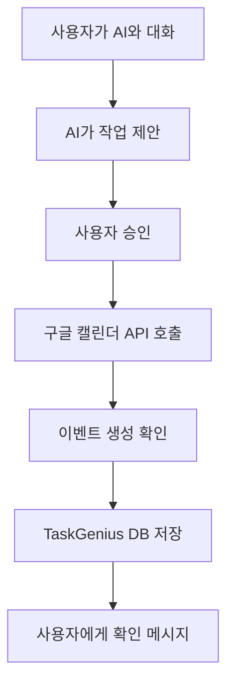

# 🧠 TaskGenius - 사업자를 위한 AI 태스크 매니저

> **프로젝트 목표**: 브랜딩 전문가와 콘텐츠 크리에이터의 노하우를 담은 AI가 사업자의 비즈니스 성장을 위한 맞춤형 업무를 매일 추천하는 서비스

## 📅 프로젝트 현황 (2025.06.26 기준)

### ✅ **완료된 작업**
- [x] **랜딩 페이지** - 서비스 소개 및 유입 페이지 완성
- [x] **Next.js 개발환경** - TypeScript 기반 프로젝트 셋업
- [x] **GitHub 연동** - 버전 관리 시스템 구축
- [x] **AI 챗봇 UI/UX** - 인터랙티브 채팅 인터페이스 완성
  - 실시간 메시지 전송/수신
  - AI 타이핑 효과 및 상태 표시
  - 스마트 제안 버튼 시스템
  - 빠른 액션 버튼 (작업 생성, 일정 관리, 팀 협업, 자동화)
  - 음성 인식 UI (구현 대기)
  - 반응형 디자인

### 🔄 **진행 중인 작업**
- [ ] 다음 단계 기능 선정 및 구현

---

## 🎯 **핵심 기능 로드맵**

### **Phase 1: 기본 시스템 구축** (1-2주)

#### 1. 🤖 **실제 AI API 연동**
- **우선순위**: 🔥 High
- **예상 소요시간**: 3-5일
- **기능**:
  - OpenAI GPT-4 또는 Claude API 연결
  - 작업 관리 전문 프롬프트 엔지니어링
  - 컨텍스트 기반 개인화 응답
  - API 키 보안 관리 (환경변수)
- **구현 파일**:
  ```
  app/api/chat/route.ts (AI API 엔드포인트)
  lib/ai-service.ts (AI 서비스 로직)
  components/ChatMessage.tsx (메시지 컴포넌트)
  ```

#### 2. 📊 **대시보드 페이지**
- **우선순위**: 🔥 High  
- **예상 소요시간**: 4-6일
- **기능**:
  - 오늘의 할 일 위젯
  - 진행 중인 프로젝트 현황
  - 성과 차트 (완료율, 생산성 지표)
  - 최근 AI 대화 요약
- **구현 파일**:
  ```
  app/dashboard/page.tsx
  components/Dashboard/
  ├── TodayTasks.tsx
  ├── ProjectStatus.tsx
  ├── PerformanceChart.tsx
  └── RecentChats.tsx
  ```

#### 3. 📅 **구글 캘린더 자동 저장 기능** ⭐ NEW
- **우선순위**: 🔥 High
- **예상 소요시간**: 3-4일
- **기능**:
  - AI가 생성한 작업을 구글 캘린더에 자동 저장
  - 데드라인 기반 일정 생성
  - 미팅 및 이벤트 자동 스케줄링
  - 리마인더 설정
- **기술 스택**:
  - Google Calendar API v3
  - OAuth 2.0 인증
  - 자동 동기화 시스템
- **구현 파일**:
  ```
  app/api/calendar/route.ts
  lib/google-calendar.ts
  components/CalendarSync.tsx
  hooks/useCalendarSync.ts
  ```

### **Phase 2: 작업 관리 시스템** (2-3주)

#### 4. ✏️ **작업 관리 CRUD**
- **우선순위**: 🟡 Medium
- **기능**:
  - 작업 생성/수정/삭제/완료
  - 우선순위 매트릭스 (아이젠하워)
  - 카테고리 분류 (콘텐츠, 마케팅, CRM)
  - 진행률 추적
  - 구글 캘린더 연동

#### 5. 👥 **팀 협업 기능**
- **우선순위**: 🟡 Medium
- **기능**:
  - 팀원 초대 및 권한 관리
  - 작업 할당 및 공유
  - 댓글 및 피드백 시스템
  - 팀 캘린더 통합

### **Phase 3: 고급 기능** (3-4주)

#### 6. 🔐 **사용자 인증 & 개인화**
- **기능**:
  - NextAuth.js 기반 인증
  - 구글/깃허브 소셜 로그인
  - 사용자별 데이터 관리
  - 개인화된 AI 추천

#### 7. 🎙️ **음성 및 멀티미디어**
- **기능**:
  - 음성 인식 (Web Speech API)
  - TTS (Text-to-Speech)
  - 파일 업로드 및 분석
  - 이미지/문서 처리

#### 8. 📱 **모바일 최적화 & PWA**
- **기능**:
  - Progressive Web App
  - 오프라인 모드
  - 푸시 알림
  - 모바일 네이티브 경험

---

## 🛠 **기술 스택**

### **Frontend**
- **Framework**: Next.js 15+ (App Router)
- **Language**: TypeScript
- **Styling**: CSS Modules (현재) / Tailwind CSS (선택)
- **Icons**: Lucide React
- **State Management**: Zustand (추후 도입)

### **Backend & Database**
- **API**: Next.js API Routes
- **Database**: PostgreSQL + Prisma ORM
- **Authentication**: NextAuth.js
- **File Storage**: Vercel Blob / AWS S3

### **External APIs**
- **AI**: OpenAI GPT-4 / Anthropic Claude
- **Calendar**: Google Calendar API v3
- **Email**: Resend / SendGrid
- **Analytics**: Vercel Analytics

### **DevOps & Deployment**
- **Hosting**: Vercel
- **Version Control**: GitHub
- **CI/CD**: GitHub Actions
- **Monitoring**: Vercel Analytics + Sentry

---

## 📋 **구글 캘린더 연동 상세 설계**

### **핵심 기능**
1. **AI 작업 → 캘린더 자동 저장**
   ```typescript
   // AI가 "내일 오후 2시에 블로그 포스팅하기" 제안 시
   // → 구글 캘린더에 자동으로 이벤트 생성
   ```

2. **스마트 스케줄링**
   - 사용자의 기존 일정 분석
   - 빈 시간대에 최적 배치
   - 작업 소요 시간 예측

3. **양방향 동기화**
   - 캘린더 → TaskGenius: 기존 일정 가져오기
   - TaskGenius → 캘린더: 새 작업 추가

### **구현 플로우**


### **API 설계**
```typescript
// app/api/calendar/sync/route.ts
export async function POST(request: Request) {
  const { task, userId, scheduledTime } = await request.json();
  
  // 1. Google Calendar API 인증
  // 2. 이벤트 생성
  // 3. TaskGenius DB 업데이트
  // 4. 사용자에게 응답
}
```

---

## 📊 **프로젝트 일정 (예상)**

| 주차 | 기간 | 주요 작업 | 예상 완료율 |
|------|------|-----------|-------------|
| **1주** | 6/26-7/2 | AI API 연동 + 대시보드 기초 | 60% |
| **2주** | 7/3-7/9 | 구글 캘린더 연동 + 대시보드 완성 | 75% |
| **3주** | 7/10-7/16 | 작업 관리 CRUD + 데이터베이스 | 85% |
| **4주** | 7/17-7/23 | 사용자 인증 + 배포 최적화 | 95% |
| **5주** | 7/24-7/30 | 고급 기능 + 테스트 + 런칭 | 100% |

---

## 🎯 **즉시 다음 단계**

### **1순위: AI API 연동** (추천)
```bash
# 바로 시작할 수 있는 작업
1. OpenAI API 키 발급
2. app/api/chat/route.ts 생성
3. 실제 AI 응답 테스트
4. 프롬프트 엔지니어링
```

### **2순위: 구글 캘린더 연동**
```bash
# 사용자 가치가 높은 기능
1. Google Cloud Console 설정
2. Calendar API 활성화
3. OAuth 2.0 설정
4. 기본 연동 테스트
```

### **3순위: 대시보드 구축**
```bash
# 사용자 경험 완성
1. /dashboard 페이지 생성
2. 위젯 컴포넌트 개발
3. 데이터 시각화
4. 반응형 디자인
```

---

## 💡 **성공 지표 (KPI)**

### **기술적 지표**
- [ ] AI 응답 속도 < 3초
- [ ] 캘린더 동기화 성공률 > 95%
- [ ] 페이지 로딩 속도 < 2초
- [ ] 모바일 반응성 점수 > 90점

### **사용자 지표**
- [ ] 일일 활성 사용자 (DAU) 목표
- [ ] 작업 완료율 향상도
- [ ] 사용자 리텐션율
- [ ] AI 제안 수용률

---

## 📝 **다음 회의 안건**

1. **우선순위 최종 결정**: AI API vs 구글 캘린더 vs 대시보드
2. **API 키 및 계정 설정**: OpenAI, Google Cloud 준비
3. **데이터베이스 스키마 설계**: 작업, 사용자, 캘린더 연동
4. **디자인 시스템 확정**: 컴포넌트 라이브러리 선택

---

**📋 문서 마지막 업데이트**: 2025년 6월 26일  
**📋 다음 업데이트 예정**: 다음 단계 완료 후

> 💡 **Tip**: 이 문서를 프로젝트 루트에 `README.md` 또는 `PROJECT_MASTER.md`로 저장하여 GitHub에서 관리하는 것을 추천합니다!